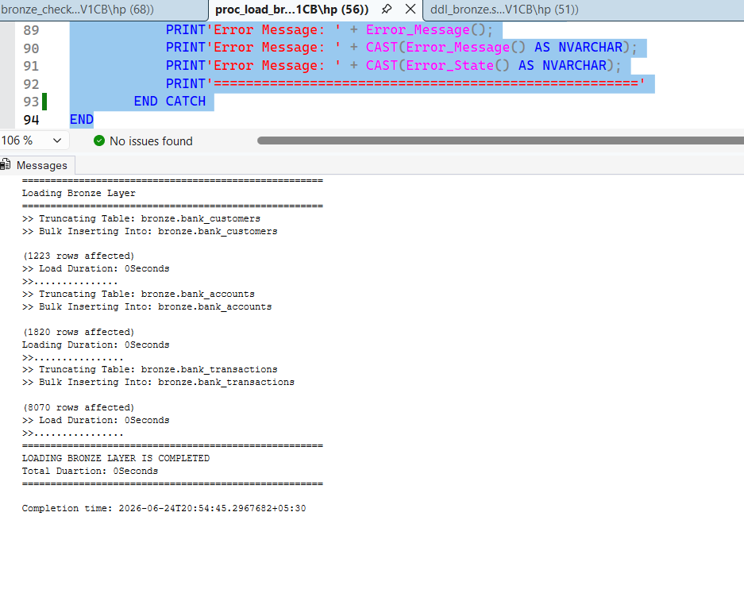

# Bank-Data-Warehouse-Project

A SQL Server data warehouse project using Medallion Architecture (Bronze, Silver, Gold) to consolidate banking customer, account, and transaction data for analytics.

## Architecture

- **Bronze** — raw data landed as-is from source CSVs (customers, accounts, transactions). No cleaning or type conversion; every column is text, matching the source exactly.
- **Silver** — cleaned, standardized, deduplicated data, loaded as proper typed tables. Built from Bronze.
- **Gold** — business-ready views for reporting and analytics (in progress).

## Naming Conventions

This project follows a consistent naming pattern across layers:
- Bronze/Silver tables: `<sourcesystem>_<entity>` (e.g. `bank_customers`)
- Gold tables/views: `<category>_<entity>` (e.g. `dim_customers`, `fact_transactions`)
- Technical/audit columns: `dwh_<column_name>` prefix
- Stored procedures: `load_<layer>` (e.g. `load_bronze`, `load_silver`)

## Bronze Layer

Loads raw CSVs into SQL Server exactly as provided by the source — no cleaning, no type conversion. Every column is stored as text since the raw files contain inconsistent formats (mixed date formats, currency symbols mixed into amounts, inconsistent casing, literal "NULL"/"N/A" text instead of real nulls).

Loaded via `bronze.load_bronze`.

## Silver Layer

Cleans and standardizes Bronze data into proper typed tables:
- Deduplication of exact duplicate records (customers, accounts, transactions)
- Explicit date parsing across multiple inconsistent source formats (`DD/MM/YYYY`, `YYYY-MM-DD`, `DD-Mon-YYYY`, and more), rather than relying on an ambiguous default cast
- Categorical standardization: gender, country, account type, customer/account status
- Amount/balance cleanup — stripped currency symbols, commas, and currency-code suffixes, converted to proper decimal values
- Referential integrity checks: accounts are only loaded if they reference a valid customer already in Silver; transactions are only loaded if they reference a valid account already in Silver

Implemented as three transformation scripts, run in order (each depends on the one before it being loaded first):
1. `proc_load_silver.sql` — customers
2. `proc_silver_customer.sql` — accounts (validates against loaded customers)
3. `proc_load_transcations.sql` — transactions (validates against loaded accounts)

## Gold Layer

*Coming soon — star schema views for reporting (dim_customers, dim_accounts, fact_transactions).*

## Repository Structure

```
bank-data-warehouse-project/
│
├── datasets/                  # raw source CSVs
├── scripts/
│   ├── bronze/                 # DDL + load_bronze procedure
│   └── silver/                 # DDL + load_silver procedure
├── tests/                      # validation & data quality check scripts
├── outputs_screenshots/        # sample execution output
└── README.md
```

## Sample Output

Bronze layer load executed successfully via `EXEC bronze.load_bronze;`



Silver layer load executed successfully via `EXEC silver.load_silver;` — a stored procedure that wraps the three transformation scripts above (customers → accounts → transactions) with error handling and load timing.

.png)
